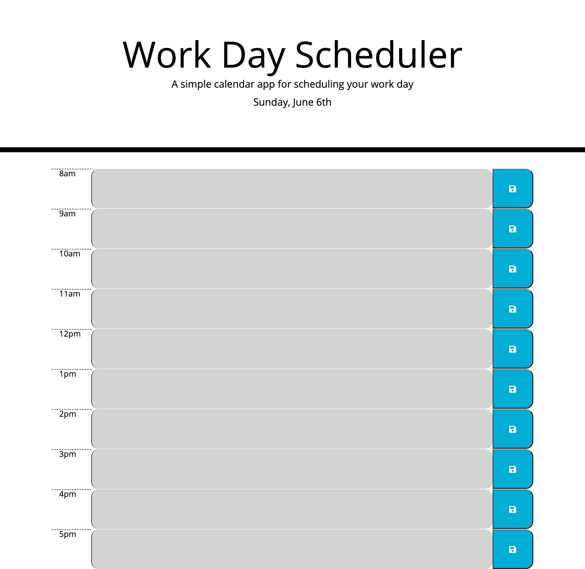

# Work-Day-Scheduler
  ## Table of Contents:
  * [Description](#Description)

  * [Website](#Website)

  * [Technologies-Used](#Languages-Used)

  * [License](#License)
  
  * [Contact](#Contact)
    
  
  ## Description:

    I was given a template to create a calendar application that allows a user to save events for each hour of the day by modifying the starter code.This app will run in the browser and feature dynamically updated HTML and CSS powered by jQuery. I also used Moment.js library to work with date and time. 
  ## Website:

  Deployed Site here: https://josejrrosas.github.io/Work-Day-Scheduler/
  

  
  ## Technologies-Used:
 * HTML
 * CSS
 * Javascript

  ## License:
    SMU bootcamp
  ## Contact: 
    * Name: Jose Rosas
    * Github: ( https://github.com/josejrrosas)
    * Email : Josejrrosas@yahoo.com